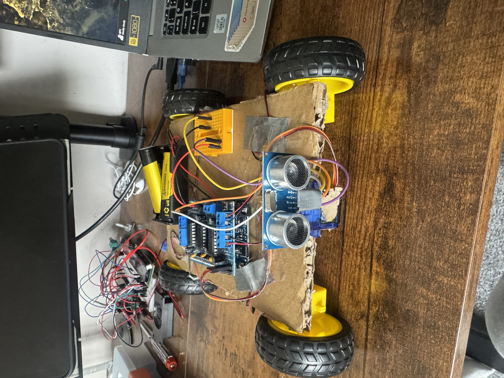

# 🤖 Obstacle Avoidance Robot (Arduino UNO + Motor Shield)

This is a DIY autonomous robot that detects and avoids obstacles using an ultrasonic sensor mounted on a servo "head." It was built using an Arduino UNO clone, a motor driver shield, cardboard chassis, and basic electronics.

This project is perfect for beginners learning about robotics, Arduino programming, and sensor-based automation.



---

## 🔧 Features

- Obstacle detection using **ultrasonic sensor (HC-SR04)**
- Sweeping motion using **SG90 servo** for side scanning
- 4-wheel movement powered by **DC motors + L298P motor shield**
- **Autonomous motion** with intelligent turning logic
- Powered by **2x 18650 rechargeable Li-ion batteries**

---

## 🧰 Materials Used

| Component                     | Quantity | Notes                                |
|------------------------------|----------|--------------------------------------|
| Arduino UNO clone            | 1        | Or genuine UNO                      |
| L298P Motor Shield (AFMotor) | 1        | Adafruit Motor Shield V1 compatible |
| DC Gear Motors               | 4        | Yellow TT motors with wheels        |
| SG90 Servo                   | 1        | For rotating the ultrasonic sensor  |
| HC-SR04 Ultrasonic Sensor    | 1        | Distance sensing                    |
| 18650 Battery (3.7V)         | 2        | Total ~7.4V                         |
| 18650 Battery Holder         | 1        | Powers the shield via EXT_PWR       |
| Mini Breadboard                   | 1        | For clean 5V & GND wiring            |
| Jumper Wires                 | 6        | Male-to-male, female-to-male        |
| Cardboard Base               | 1        | For chassis                         |
| Glue Gun / Tape              | As needed| To fix parts in place               |

---

## 🛠 Wiring Guide

### 🔌 Motors:
| Wheel        | Shield Terminal | Direction for Forward |
|--------------|------------------|------------------------|
| Front Right  | M1               | BACKWARD               |
| Front Left   | M2               | BACKWARD               |
| Back Left    | M3               | FORWARD (reversed)     |
| Back Right   | M4               | BACKWARD               |

### 🔧 Ultrasonic Sensor:
| Sensor Pin | Arduino Pin |
|------------|-------------|
| VCC        | 5V (from shield) |
| GND        | GND (from shield) |
| Trig       | A4          |
| Echo       | A5          |

### 🔁 Servo Motor:
- Signal → D9 (`SERVO_2` pin on motor shield)
- VCC and GND to breadboard 5V / GND

---

## 📦 Arduino Libraries Required

Install these via **Arduino Library Manager**:

1. ✅ `Adafruit Motor Shield Library` (V1)
2. ✅ `Servo` (built-in)

---

## 🚀 Getting Started

1. Upload `obstacle_avoidance_robot.ino` to your Arduino UNO using the Arduino IDE
2. Power the robot using the **2x 18650 battery pack**
3. Place it on the floor and watch it scan, move, and avoid obstacles!

---

## ⚙️ Configuration Options

You can customize:
```cpp
byte motorSpeed = 120;    // Adjust speed (0–255)
byte stopDist = 50;       // Distance in cm to stop before an obstacle

---

## 🧠 Credits

Built by [David Olutunde]([https://davidolutunde.com])  
Inspired by code from [Michael Klements – The DIY Life](https://www.the-diy-life.com)

---

## 📝 License

This project is open-source under the [MIT License](https://opensource.org/licenses/MIT).  
Feel free to use, remix, and share it in personal or educational projects!
